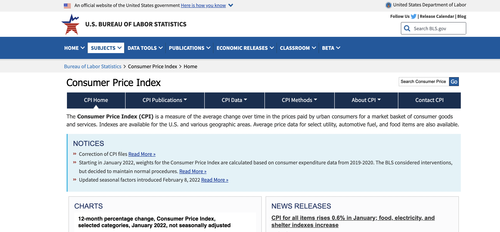
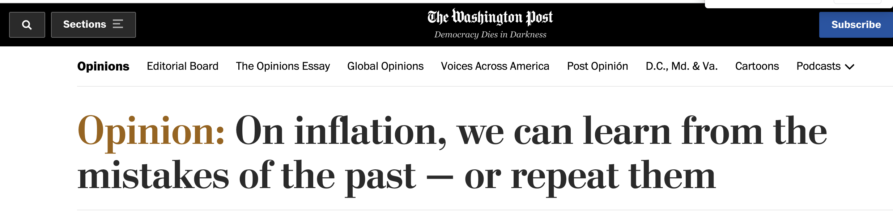
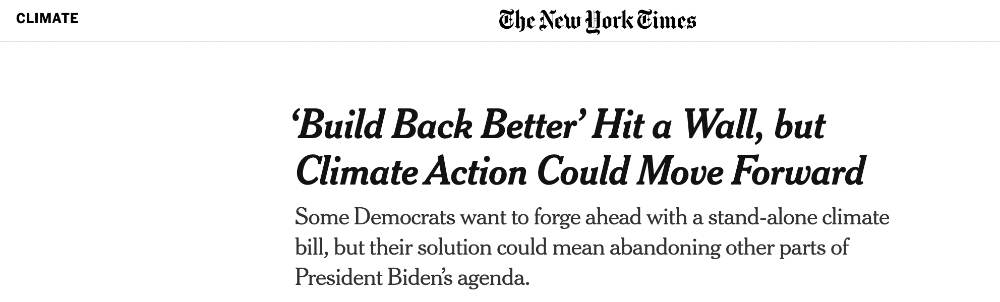

```{r setup, include=FALSE}
knitr::opts_chunk$set(warning = FALSE, message = FALSE, 
                      fig.retina = 3, fig.align = "center")
```

```{r xaringanExtra, echo=FALSE}
xaringanExtra::use_xaringan_extra(c("tile_view"))
```

```{r packages-data, include=FALSE}
library(tidyverse)
library(hrbrthemes)
library(ggeasy)
library(plotly)
library(scales)
library(tsibble)
library(gganimate)
library(lubridate)
library(patchwork)
library(zoo)

theme_set(theme_ipsum_rc())

cpi_data <- read_csv("cpi-data.csv")


cpi_data <- cpi_data %>% 
  mutate(period = mdy(period))

cpi_data_ts <- cpi_data %>% 
  select(period, cpi, cpi_food, cpi_energy, cpi_less) %>% 
  as_tsibble(index = period) %>% 
  pivot_longer(c(cpi, cpi_food, cpi_energy, cpi_less), names_to = "series")


gdp_data <- read_csv("gdp-data.csv")


gdp_data <- gdp_data %>% 
  mutate(period = mdy(period)) %>% 
  mutate(qtr =  as.yearqtr(period, format = "%Y-%m-%d"))


gdp_data <- gdp_data %>%
  mutate(gdp = as.double(gdp)) 


gdp_ts <- gdp_data %>% 
  select(qtr, pot, gdp) %>% 
  pivot_longer(c(pot, gdp), names_to = "series")

```


class: center middle main-title section-title-1

# Inflation:<br>Why's, who's, & how's

.class-info[

**Marcio Santetti**

.light[Lawrence University<br>
February 2022
]

]


---

class: center middle main-title section-title-7

**Marcio Santetti**


**Ph.D. Candidate**

**University of Utah**

<br>


[`r fontawesome::fa("envelope")` santetti@gmail.com](mailto:santetti@gmail.com) <br>
[`r fontawesome::fa("link")` marcio.rbind.io](https://marcio.rbind.io) <br>
[`r fontawesome::fa("github")` github.com/marciosantetti](https://github.com/marciosantetti)


---

name: overview
class: title title-inv-1

# Overview

--

.box-1.medium.sp-after-half[Why should we care?]

--

.box-2.medium.sp-after-half[The present picture]

--

.box-3.medium.sp-after-half[Whose side to pick?]

--

.box-4.medium[Future paths]


---

name: why
class: center middle section-title section-title-1 animated fadeIn

# Why should we care?


---

class: title title-inv-1

# Why should we care?


.box-2.medium.sp-after-half[*“The purpose of studying economics is not to acquire a set of readymade answers to economic questions, but to learn how to avoid being
deceived by economists.”*<sup>1</sup>]

<br>

.small[1: Joan Robinson. *Collected Economic
Papers*, 1980, Vol. 2 p. 17.]

---
class: title title-inv-1

# Why should we care?

<br>

.box-2.medium.sp-after-half[Quick poll:]


.box-2.large.sp-after-half[[bit.ly/3gKUZcm](bit.ly/3gKUZcm)]


---



---

class: title title-inv-1

# Why should we care?

<br>


.box-1.medium.sp-after-half[Inflation is REAL]

--

.box-2.medium.sp-after-half[Continuousy rising price level]

--

.box-3.medium.sp-after-half[Falling value of money]


---

class: title title-inv-1

# Why should we care?

<br>

.pull-left[


]


.pull-right[


]


---

class: title title-inv-1

# Why should we care?

<br>

.pull-left[

.box-3.large.sp-after-half[Cost-push]

.box-3.small.sp-after-half[Wage bargaining]

.box-3.small.sp-after-half[Oil price shocks]

]
--


.pull-right[

.box-4.large.sp-after-half[Demand-pull]

.box-4.small.sp-after-half[Full capacity?]

.box-4.small.sp-after-half[Output gap]

]

---

name: present
class: center middle section-title section-title-2 animated fadeIn

# The present picture


---

class: title title-inv-2


# The present picture


---


class: title title-inv-2

# The present picture

```{r, echo=FALSE, fig.height = 7, fig.width=13, dev = "svg"}

cpi_data %>% 
  ggplot(aes(x = period, y = cpi)) +
  geom_line(color = "#993333", size = 1, alpha = 0.7) +
  scale_y_continuous(labels = percent_format(scale=1)) +
  geom_hline(yintercept = 0) +
  labs(x = "",
       y = "",
       title = "Consumer Price Index: All items",
       subtitle = "Change from a Year ago",
       caption = "Source: BLS.") +
  easy_x_axis_labels_size(17) +
  easy_y_axis_labels_size(17) +
  easy_plot_title_size(30) +
  easy_plot_caption_size(17) +
  easy_plot_subtitle_size(22)
```


---


class: title title-inv-2

# The present picture

<br><br>

.box-4.large.sp-after-half[What categories matter?]


---


class: title title-inv-2

# The present picture


---

name: side
class: center middle section-title section-title-3 animated fadeIn

# Whose side to pick?

---


class: title title-inv-3

# Whose side to pick?




---
class: title title-inv-3

# Whose side to pick?

<br>


---
class: title title-inv-3

# Whose side to pick?


---

class: title title-inv-3

# Whose side to pick?


---
class: title title-inv-3

# Whose side to pick?


---

name: present
class: center middle section-title section-title-4 animated fadeIn

# Future paths


---

class: title title-inv-4

# Future paths


```{r, echo=FALSE, dev="svg", fig.width=13}
gdp_ts %>% 
  ggplot(aes(x = qtr, y = value)) +
  geom_line(aes(color = series), size = 0.9, alpha = 0.7) +
  scale_y_continuous(labels = comma) +
  labs(y = "Billions of Chained 2012 Dollars",
       x = "",
       title = "Actual vs. Potential GDP: 2015-2022",
       caption = "Data from FRED St. Louis.") +
  scale_color_discrete(labels = c("Actual GDP", "Potential GDP")) +
  easy_y_axis_title_size(17) +
  easy_plot_title_size(20) +
  easy_x_axis_labels_size(15) +
  easy_y_axis_labels_size(15) +
  easy_plot_legend_size(15) +
  easy_plot_title_size(25) +
  easy_remove_legend_title() +
  easy_plot_caption_size(17) +
  easy_plot_legend_size(18)
```


---
class: title title-inv-4

# Future paths


---

class: title title-inv-4

# Future paths




---

name: present
class: center middle main-title section-title-1 animated fadeIn

# Thank you!

---
exclude: true